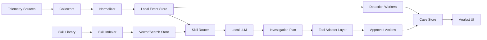

# Adopting This Repo for a Local AI Security Monitoring App

## Executive Summary

This repository is best used as an AI-native security operations knowledge base, not as a drop-in application. It contains 754 cybersecurity skills organized as structured playbooks with YAML frontmatter, step-by-step workflows, helper scripts, references, and framework mappings. A local AI app should adopt the repo as its skill library, then add the missing product layer: telemetry collection, local storage, skill retrieval, tool adapters, analyst review, and controlled automation.

The right first product is a local SOC assistant that ingests endpoint, identity, network, API, cloud, and threat-intelligence signals; maps alerts to the most relevant skills; runs safe local analysis; drafts investigation findings; and executes only approved response actions.

## What This Repo Provides

The useful primitives are:

- `index.json`: a lightweight catalog with skill names, paths, descriptions, and total skill count. This should power fast skill discovery.
- `skills/*/SKILL.md`: the operational playbook format. Each skill includes trigger conditions, prerequisites, workflow steps, verification guidance, tags, subdomain, and framework mappings such as MITRE ATT&CK and NIST CSF.
- `skills/*/scripts/agent.py`: runnable helper agents for many skills. These are useful as reference implementations or sandboxed tools, but they should be wrapped before production use.
- `skills/*/scripts/process.py`: workflow-specific processors for reporting, scoring, validation, onboarding tracking, and similar tasks.
- `skills/*/references/*.md`: deeper technical references and standards mappings that can be loaded on demand.
- `skills/*/assets/template.md`: report/checklist templates that can become app-generated analyst artifacts.
- `ATTACK_COVERAGE.md` and `mappings/`: coverage material for ATT&CK, NIST CSF, and related framework views.

The repo does not provide:

- A running app shell
- A telemetry pipeline
- Authentication, authorization, tenancy, or audit logging
- A durable case/alert database
- A safe automation approval model
- Normalized schemas for security events
- A production-grade tool execution sandbox

## Product Shape

Build a local-first app with five layers:

1. Telemetry layer
   - Collect logs and alerts from Wazuh, Sysmon, osquery, Zeek, Suricata, cloud audit logs, API gateway logs, email security logs, and identity providers.
   - Normalize events into a small local schema: `event`, `asset`, `identity`, `alert`, `ioc`, `case`, `action`, and `evidence`.

2. Skill intelligence layer
   - Parse `index.json` and every `SKILL.md` frontmatter.
   - Embed skill descriptions, tags, prerequisites, and workflow headings into a local vector store.
   - Keep full skill bodies and references on disk. Load them only after the router selects a skill.

3. Analysis layer
   - Use a local LLM to triage alerts, choose relevant skills, generate investigation plans, summarize evidence, and draft findings.
   - Use deterministic Python detectors for repeatable analytics such as impossible travel, process injection, DNS tunneling, API abuse, IOC matching, and vulnerability prioritization.

4. Automation layer
   - Wrap skill scripts behind typed tool adapters.
   - Separate actions into read-only, analysis-only, containment, and destructive categories.
   - Require human approval for containment and destructive actions.

5. Analyst UX layer
   - Provide a local dashboard with alert queue, case timeline, evidence graph, selected skills, recommended next steps, and action approval controls.
   - Generate reports using the repo templates where available.

## Recommended Local Stack

- App shell: Rust core with Tauri desktop shell and a shared React/Vite web UI.
- Server shell: Rust `axum` or similar HTTP/WebSocket service serving the same web UI for continuous operation.
- Local model runtime: llama.cpp first, using `llama-server` as a managed sidecar in desktop mode and a supervised service/container in server mode.
- Structured store: SQLite for local desktop and small servers; Postgres for team/server deployments.
- Search store: SQLite FTS or Tantivy for skills, cases, and local evidence search.
- Vector store: local LanceDB, Qdrant, pgvector, or sqlite-vec only if semantic search is needed beyond FTS/tag matching.
- Analytics runtime: Rust detectors and workers by default, with sandboxed Python adapters only for existing skill scripts that are worth wrapping.
- Endpoint/SIEM core: Wazuh is the best local-first default because this repo already includes `implementing-endpoint-detection-with-wazuh`.
- Network monitoring: Zeek and Suricata for DNS, HTTP, TLS, flow, and IDS telemetry.
- Endpoint enrichment: Sysmon on Windows, osquery across endpoints, Linux audit logs where available.
- Threat intelligence: MISP or OpenCTI for local CTI, with STIX/TAXII feed ingestion.
- Task execution: Tokio-based local worker queues or a durable Rust job runner with strict action policy checks.

## Skill Adoption Model

Treat skills as versioned capabilities with a small internal manifest:

```json
{
  "skill_id": "detecting-anomalous-authentication-patterns",
  "path": "skills/detecting-anomalous-authentication-patterns",
  "mode": "analysis",
  "required_connectors": ["identity_logs", "geoip"],
  "allowed_actions": ["read_events", "run_detector", "create_case", "draft_report"],
  "approval_required": false
}
```

Use three execution modes:

- Advisory skills: load the workflow and ask the model to produce a plan or checklist. Good for tabletop exercises, governance, and architecture guidance.
- Query-generating skills: have the model produce Splunk SPL, Sigma, Wazuh queries, SQL, OpenSearch DSL, or pandas filters, then validate before execution.
- Tool-backed skills: call a wrapped script or adapter. Good for Wazuh API checks, process-injection detection, CAPE submission, STIX/TAXII feed processing, and onboarding validation.

Do not let the LLM directly run shell commands from `SKILL.md`. Commands should be converted into reviewed adapters or suggested to the analyst.

## First Skills to Productize

Start with a defensive MVP using skills that map directly to monitoring workflows:

| App capability | Skills to adopt first |
|---|---|
| Endpoint/XDR monitoring | `implementing-endpoint-detection-with-wazuh`, `configuring-host-based-intrusion-detection`, `deploying-osquery-for-endpoint-monitoring` |
| Windows detection | `configuring-windows-event-logging-for-detection`, `detecting-malicious-scheduled-tasks-with-sysmon`, `hunting-for-process-injection-techniques`, `detecting-t1055-process-injection-with-sysmon` |
| Identity monitoring | `detecting-anomalous-authentication-patterns`, `detecting-service-account-abuse`, `detecting-dcsync-attack-in-active-directory`, `detecting-pass-the-hash-attacks` |
| Network monitoring | `configuring-suricata-for-network-monitoring`, `detecting-beaconing-patterns-with-zeek`, `detecting-command-and-control-over-dns`, `detecting-dns-exfiltration-with-dns-query-analysis` |
| SIEM onboarding and investigation | `performing-log-source-onboarding-in-siem`, `analyzing-security-logs-with-splunk`, `building-detection-rules-with-sigma`, `implementing-alert-fatigue-reduction` |
| API security monitoring | `analyzing-api-gateway-access-logs`, `detecting-api-enumeration-attacks` |
| Threat intelligence | `processing-stix-taxii-feeds`, `automating-ioc-enrichment`, `building-ioc-enrichment-pipeline-with-opencti`, `building-threat-feed-aggregation-with-misp` |
| Malware triage | `performing-automated-malware-analysis-with-cape`, `extracting-iocs-from-malware-samples`, `analyzing-malware-behavior-with-cuckoo-sandbox` |
| Incident response | `building-incident-response-playbook`, `containing-active-breach`, `conducting-malware-incident-response`, `building-incident-timeline-with-timesketch` |
| Vulnerability automation | `building-vulnerability-scanning-workflow`, `prioritizing-vulnerabilities-with-cvss-scoring`, `implementing-epss-score-for-vulnerability-prioritization` |

Keep exploitation and red-team skills installed but disabled by default. They should be available only in an explicit lab mode with separate authorization and logging.

## Core Workflows

### Alert Triage

1. Ingest alert from Wazuh, Suricata, Zeek, osquery, or API logs.
2. Normalize the event and enrich with asset, identity, GeoIP, IOC, and ATT&CK context.
3. Retrieve relevant skills from the local skill index.
4. Load the top skill body and references.
5. Generate an investigation checklist.
6. Run approved read-only detectors.
7. Create or update a case with evidence, severity, confidence, and recommended next steps.

### Threat Hunt

1. Analyst selects a hypothesis such as process injection, DNS tunneling, unusual service installation, or impossible travel.
2. App retrieves matching threat-hunting skills.
3. Skill workflow is converted into queries or Python detectors.
4. Results are scored, de-duplicated, and grouped into hunt findings.
5. The app records coverage gaps such as missing Sysmon Event ID 8, DNS logs, or identity baselines.

### Automation With Human Approval

1. Detection creates a recommended action: isolate host, disable account, block IOC, submit sample, open ticket, or collect forensic package.
2. Policy engine classifies the action.
3. Read-only and analysis-only actions can run automatically.
4. Containment actions require analyst approval.
5. Destructive actions require elevated approval and a rollback plan.
6. Every tool call records input, output, operator, timestamp, skill ID, and resulting case ID.

## Suggested Architecture



## Local Data Model

Minimum tables/entities:

- `events`: normalized telemetry with raw payload pointer.
- `alerts`: detector outputs, source severity, normalized severity, confidence, status.
- `cases`: grouped alerts, summary, owner, state, business impact.
- `evidence`: queries run, files collected, logs, screenshots, reports, hashes.
- `skills`: parsed skill metadata, version, path, checksum, mode, allowed actions.
- `actions`: proposed and executed automations with approval state and audit trail.
- `assets`: hostname, IPs, owner, criticality, OS, agent status.
- `identities`: user, role, department, MFA state, privileged status.
- `iocs`: indicators, source feed, confidence, TLP, expiration.

## Guardrails

- Default to local-only processing. Do not send telemetry, logs, samples, or case notes to remote LLMs unless explicitly enabled.
- Store secrets in the OS keychain or a local secrets manager, not in skill files or job configs.
- Run skill scripts in a restricted worker with timeouts, network egress controls, and explicit allowlists.
- Maintain an action policy file that defines which skills can call which tools.
- Require approval for host isolation, account disablement, firewall changes, ticket closure, deletion, quarantine, and any exploit-like activity.
- Keep red-team and exploitation skills disabled outside lab mode.
- Record model prompts, selected skills, tool calls, outputs, and approvals for auditability.
- Add deterministic validation for generated queries before execution.
- Preserve raw evidence and avoid modifying source logs.

## MVP Plan

### Phase 1: Skill Index and Local Analyst Assistant

- Parse `index.json` and all `SKILL.md` frontmatter.
- Build local full-text and vector search over skill metadata.
- Implement a skill router that returns the top 3 relevant skills for an alert or question.
- Add a case view that shows selected skills, workflow steps, and analyst notes.
- Use advisory mode only.

### Phase 2: Read-Only Monitoring

- Deploy Wazuh locally and ingest its alerts.
- Add parsers for Sysmon JSON, Zeek DNS/HTTP logs, Suricata EVE JSON, and API gateway JSON logs.
- Implement read-only detectors from the first skill set:
  - Process injection from Sysmon Event IDs 8 and 10
  - Impossible travel and password spraying from auth logs
  - DNS tunneling and beaconing from Zeek/DNS logs
  - API enumeration and 401 surges from API gateway logs
- Generate case summaries with cited evidence and mapped ATT&CK techniques.

### Phase 3: Tool-Backed Skills

- Wrap `skills/implementing-endpoint-detection-with-wazuh/scripts/agent.py` as a typed Wazuh adapter.
- Wrap process-injection, SIEM onboarding, STIX/TAXII, and CAPE scripts as controlled workers.
- Add job scheduling, timeouts, structured outputs, and tool-call audit logs.
- Add report generation using `assets/template.md` files where available.

### Phase 4: Controlled Response Automation

- Add action approval workflows.
- Support low-risk automation first: enrich IOC, create case, draft ticket, collect endpoint metadata, submit sample to local sandbox.
- Add medium-risk containment next: block IOC, isolate endpoint, disable account, only with approval.
- Add rollback tracking for every containment action.

### Phase 5: Coverage and Continuous Improvement

- Use `ATTACK_COVERAGE.md` and `mappings/` to show detection coverage by ATT&CK tactic and NIST CSF function.
- Track which skills have active detectors, which are advisory only, and which are disabled.
- Add false-positive feedback loops to tune detector thresholds and skill routing.
- Add regression tests with sample logs for every detector.

## Implementation Checklist

- Build `SkillLoader` to parse `index.json`, `SKILL.md` frontmatter, body sections, references, scripts, and templates.
- Build `SkillRouter` with keyword, tag, ATT&CK, and vector matching.
- Define tool contracts: `collect`, `search`, `detect`, `enrich`, `respond`, `report`.
- Normalize events to ECS-like field names where possible.
- Add a policy engine before every tool execution.
- Add durable case and action audit tables.
- Create sample datasets for Sysmon, Zeek, Suricata, auth, API gateway, and Wazuh alerts.
- Convert the first 10 skills into typed adapters or advisory recipes.
- Add tests for frontmatter parsing, skill selection, detector output, and action policy enforcement.

## Success Criteria

The first useful version should be able to:

- Ingest local Wazuh and JSON log files.
- Route an alert to relevant skills in under a second.
- Explain why a skill was selected.
- Run at least four read-only detectors.
- Create a case with timeline, evidence, ATT&CK mapping, severity, confidence, and recommended actions.
- Generate an analyst-ready report without sending data outside the machine.
- Block unsafe automation unless explicitly approved.
