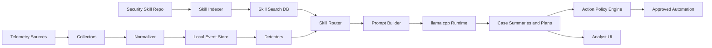

# Local Rust + llama.cpp Security AI Product Blueprint

## Decision

Yes, we can build this as a local product, but `srothgan/claude-code-rust` should not be the product runtime.

Use it only as an optional developer interface for working with this repository. It is a Rust terminal UI for Claude Code that wraps Anthropic's Agent SDK, so it still depends on Claude Code authentication and remote Claude usage. It is not a local inference runtime and it will not run Gemma through llama.cpp.

The local product should be our own Rust application that embeds or launches llama.cpp, loads this repository's skills, and runs security-monitoring workflows against local telemetry.

## Installed Developer Tool

`claude-code-rust` has been installed via npm.

The command is available at:

```bash
/Users/swaroop/.hermes/node/bin/claude-rs
```

Verified version:

```bash
claude-rs 0.12.1
```

Current limitation: `/Users/swaroop/.hermes/node/bin` is not on this shell's `PATH`, and this machine does not currently have `~/.claude/config.json`. Without Claude Code authentication, `claude-rs` will install but cannot start a working Claude session.

## Product Architecture

Build a separate local app with these components:



## Recommended Rust Shape

Use a Rust workspace:

```text
local-security-ai/
  crates/
    skill-indexer/        # parses index.json and SKILL.md frontmatter
    telemetry-core/       # event schema, parsers, enrichment
    detection-engine/     # deterministic detectors
    llama-runtime/        # llama.cpp process or FFI wrapper
    policy-engine/        # action allowlists and approval checks
    api-server/           # local HTTP/WebSocket API
    desktop-ui/           # optional Tauri shell
  vendor/
    llama.cpp/            # pinned llama.cpp source or release binary
  models/
    README.md             # model download instructions; no large model in git
  data/
    skills.db
    events.db
    cases.db
```

Start with `llama-server` as a managed child process instead of direct FFI. It gives us an OpenAI-compatible local API, isolates crashes from the app, and makes model/runtime upgrades simpler. Move to FFI only if process overhead or deployment requirements force it.

## Model Plan

Gemma 4 31B exists and has GGUF distributions suitable for llama.cpp. For a security product, use an instruction-tuned GGUF variant such as:

```bash
llama-server -hf unsloth/gemma-4-31B-it-GGUF:UD-Q4_K_XL \
  --host 127.0.0.1 \
  --port 8088 \
  --ctx-size 32768
```

Practical guidance:

- Prefer `UD-Q4_K_XL` or `Q4_K_M` first for a workstation build.
- Ship model download scripts, not model weights, unless distribution rights and package size are deliberately handled.
- Keep a smaller fallback model for laptops or air-gapped deployments with limited RAM.
- Add a model health check before enabling AI-assisted triage.

## How The Skills Fit

Use this repo as the local knowledge layer:

- `index.json` powers fast discovery.
- `SKILL.md` frontmatter becomes searchable metadata.
- Full `SKILL.md` bodies are loaded only after routing.
- `scripts/agent.py` and `scripts/process.py` become reviewed tool adapters, not arbitrary code for the model to execute.
- `references/*.md` are retrieved only when the model needs deeper procedural context.
- `assets/template.md` files become report and checklist templates.

The runtime flow:

1. Alert arrives from Wazuh, Sysmon, Zeek, Suricata, osquery, API logs, or identity logs.
2. Event normalizer converts it into the local schema.
3. Deterministic detectors add confidence, severity, and ATT&CK context.
4. Skill router selects relevant skills.
5. Prompt builder sends only alert facts, selected skill excerpts, and policy constraints to llama.cpp.
6. Model produces an investigation plan, summary, or proposed action.
7. Policy engine blocks unsafe action classes until approved.
8. Case store records evidence, model output, skill IDs, and action audit trail.

## First MVP

Build the first version around read-only workflows:

- Skill indexer for all 754 skills.
- Local SQLite event and case store.
- llama.cpp child-process manager.
- Wazuh alert import.
- Sysmon JSON file import.
- Four detectors:
  - Process injection
  - Suspicious PowerShell
  - Impossible travel / password spray
  - DNS tunneling / beaconing
- Case summary generation with cited evidence.
- Analyst approval screen for any response action.

## Guardrails

- Bind llama.cpp to `127.0.0.1` only.
- No telemetry leaves the machine by default.
- No model-generated shell commands execute directly.
- Tool adapters must be typed, allowlisted, logged, and timeout-bound.
- Exploitation and red-team skills stay disabled unless explicit lab mode is enabled.
- Containment actions require approval: isolate host, disable user, block IOC, quarantine file, change firewall/WAF policy.
- Every case records selected skill IDs, prompt inputs, model output, detector output, and operator approvals.

## Build Order

1. Create Rust workspace and event schema.
2. Implement skill indexer and skill search.
3. Add llama.cpp process manager and OpenAI-compatible client.
4. Implement telemetry import for Wazuh and JSON logs.
5. Port or wrap the first detectors.
6. Add case generation and audit logging.
7. Add local web UI or Tauri desktop shell.
8. Add action policy and approval workflow.
9. Package llama.cpp per target platform.
10. Add model download/bootstrap command.
