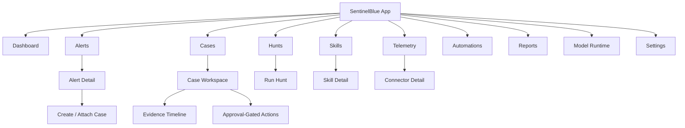

# UX And Design System: SentinelBlue

## 1. Design Brief

SentinelBlue is a dense, operational security workbench for local-first monitoring, investigation, and approval-gated automation. The same product language must work in three contexts:

- Tauri desktop app running on a single analyst workstation.
- Desktop client connected to a private SentinelBlue server.
- Server web UI running continuously for a team.

The UI should make the product feel like a trustworthy SOC console: clear hierarchy, fast scanning, restrained color, strong evidence visibility, and careful friction around risky actions.

## 2. Design Goals

- Help users answer "what needs attention now?" in under 30 seconds.
- Keep deterministic evidence visible next to AI summaries.
- Make model state, telemetry coverage, and automation policy obvious.
- Support light, dark, and system themes with the same component geometry.
- Use Meta-inspired blue as the brand accent without making the interface one-note.
- Avoid marketing-page patterns. The first screen is the working dashboard.
- Scale from a laptop viewport to a server browser viewport without losing table usability.

## 3. Product Navigation

Primary navigation uses a left sidebar on desktop and server web UI. The top bar is reserved for global search, runtime health, connection mode, notifications, and user/admin controls.

### 3.1 Navigation Items

| Item | Purpose | Primary User |
|---|---|---|
| Dashboard | Current risk, queue, coverage, model/runtime health | All users |
| Alerts | Prioritized alert triage queue | Analyst |
| Cases | Incident workspaces and closed reports | Analyst, incident commander |
| Hunts | Hypothesis-driven searches and skill-guided workflows | Analyst, security engineer |
| Skills | Searchable cybersecurity skills/playbooks from this repo | Analyst, engineer |
| Telemetry | Connectors, parsers, source health, ingestion lag | Engineer |
| Automations | Approval queue, policies, action history | Engineer, incident commander |
| Reports | Exportable incident, daily, and coverage reports | Analyst, manager |
| Model Runtime | llama.cpp status, model preset, benchmark, logs | Admin, engineer |
| Settings | Users, roles, secrets, retention, deployment mode | Admin |

### 3.2 Mode Indicators

The app must always show one compact mode indicator:

- `Local Desktop`: data and model are local to this workstation.
- `Connected Desktop`: UI is local; backend is a private server.
- `Server`: this instance is serving a team or continuous monitor.
- `Deterministic Only`: model is unavailable or intentionally disabled.

## 4. Information Architecture



## 5. Core Screen Designs

### 5.1 Dashboard

Purpose: command center for current operational state.

Layout:

- Top status strip: deployment mode, model health, ingestion status, active sources, pending approvals.
- Main queue: highest priority alerts with severity, confidence, source, ATT&CK tactic, assigned case, and last seen.
- Incident band: open cases grouped by severity and owner.
- Coverage band: active telemetry sources, last event time, parser health, detection coverage.
- Runtime band: model preset, tokens/sec benchmark, context window, queue depth, deterministic-only state.
- Approval band: pending containment or destructive actions requiring review.

Behavior:

- Clicking a dashboard alert opens alert detail without losing filters.
- Model degraded state never blocks deterministic alert review.
- Empty state should show configured sources and next available onboarding action.

### 5.2 Alerts Queue

Purpose: fast triage and prioritization.

Required controls:

- Severity filter.
- Source filter.
- Time range.
- ATT&CK tactic/technique filter.
- Skill match filter.
- Status filter: new, triaged, case, suppressed, false positive.
- Search over host, user, process, domain, IP, file hash, rule title, and case ID.

Table columns:

- Severity.
- Confidence.
- Alert title.
- Primary entity.
- Source.
- ATT&CK.
- Skill match.
- First seen.
- Last seen.
- Status.

Alert detail panel:

- Deterministic reason.
- Evidence records with source citations.
- Related alerts and cases.
- AI summary with confidence and uncertainty.
- Recommended skill/playbook.
- Suggested next queries.
- Action proposals, if policy allows.

### 5.3 Case Workspace

Purpose: one place to investigate, decide, act, and report.

Layout:

- Header: case ID, title, severity, confidence, status, owner, timer, tags.
- Left column: evidence timeline and entity graph.
- Center column: selected event, raw evidence, normalized fields, related detections.
- Right column: AI analysis, matched skills, recommended next steps, approvals.
- Footer or command bar: add note, run hunt, attach alert, request approval, export report.

AI output contract:

- Always cite evidence IDs.
- Separate facts, inferences, recommended actions, and unknowns.
- Show model/prompt version.
- Allow "regenerate summary" but preserve previous versions in audit history.
- Never present unsupported model claims as detections.

Case states:

- New.
- Triage.
- Investigating.
- Containment pending.
- Contained.
- Recovery.
- Closed true positive.
- Closed false positive.
- Closed informational.

### 5.4 Hunt Workspace

Purpose: convert skills and hypotheses into repeatable searches.

Flow:

1. Select a skill, ATT&CK technique, IOC set, or saved hypothesis.
2. Review required telemetry and data freshness.
3. Choose target scope and time range.
4. Run deterministic query/detector.
5. Review results with evidence.
6. Attach findings to a case or save as a scheduled hunt.

The model can draft the query plan and explain results. The backend decides which queries are valid and which data sources are available.

### 5.5 Skills Library

Purpose: operationalize this repository's cybersecurity skills.

Views:

- Searchable table of skills.
- Facets: domain, subdomain, ATT&CK mapping, platform, tool requirement, automation readiness.
- Detail view with description, workflow, required inputs, supported data sources, related detectors, and report templates.

Skill statuses:

- `Advisory`: usable as guidance only.
- `Detector-backed`: linked to deterministic detection logic.
- `Tool-backed`: linked to an approved enrichment or response adapter.
- `Lab-only`: visible only when lab mode is enabled.
- `Disabled`: hidden from routing unless explicitly allowed.

### 5.6 Telemetry

Purpose: make source coverage and ingestion quality visible.

Connector row fields:

- Source type.
- Status.
- Last event.
- Ingestion rate.
- Parser errors.
- Credential state.
- Data retention.
- Linked detectors.

Connector detail:

- Setup state.
- Recent raw samples.
- Normalized field preview.
- Parser warnings.
- Detection coverage.
- Test connection.
- Rotate secret.
- Disable connector.

### 5.7 Automations And Approvals

Purpose: keep autonomous behavior safe and auditable.

Approval item must show:

- Proposed action.
- Target entity.
- Triggering evidence.
- Policy rule that allowed proposal.
- Expected effect.
- Blast radius.
- Rollback option, if available.
- Expiration time.
- Required role.
- Dry-run result, where supported.

Destructive or containment actions require explicit approval with a typed confirmation for high severity actions such as host isolation, account disablement, token revocation, or firewall block creation.

### 5.8 Model Runtime

Purpose: expose local inference as a visible operational dependency.

Required fields:

- Runtime mode: sidecar, external endpoint, server service, deterministic only.
- Model preset and local path/HF repo alias.
- Host binding.
- API authentication state.
- Health status.
- Context size.
- Queue depth.
- Tokens/sec benchmark.
- Memory estimate.
- Recent runtime logs.
- Last prompt failure.

Primary actions:

- Start.
- Stop.
- Restart.
- Benchmark.
- Change preset.
- Import local model.
- Open logs.
- Switch to deterministic only.

### 5.9 Server Admin

Purpose: continuous deployment administration.

Screens:

- Users and roles.
- API keys and service tokens.
- TLS/reverse proxy guidance.
- Backup and restore.
- Retention and compaction.
- Worker status.
- Metrics endpoint.
- Audit log.
- Update status.

Server mode must remove desktop-only affordances such as tray controls while preserving the same case, alert, hunt, and automation workflows.

## 6. Theme System

The visual language is Meta-blue inspired, not a direct brand clone. Blue is reserved for primary actions, focus, links, selected states, model/runtime indicators, and neutral information accents. Severity colors must remain distinct from brand blue.

### 6.1 Core Palette

| Token | Light | Dark | Use |
|---|---:|---:|---|
| `color-brand-700` | `#0064E0` | `#5EA2FF` | Primary action, selected nav |
| `color-brand-600` | `#0082FB` | `#3392FF` | Links, focus accents |
| `color-brand-500` | `#0A7CFF` | `#0A7CFF` | Charts, runtime state |
| `color-bg` | `#F6F8FB` | `#0B111A` | App background |
| `color-surface` | `#FFFFFF` | `#101A27` | Panels, tables |
| `color-surface-raised` | `#F9FBFE` | `#162235` | Popovers, modals |
| `color-border` | `#D9E1EC` | `#26364A` | Dividers, controls |
| `color-text` | `#111827` | `#E7EDF6` | Primary text |
| `color-text-muted` | `#5B6678` | `#A7B2C2` | Secondary text |
| `color-focus` | `#0082FB` | `#5EA2FF` | Keyboard focus ring |

### 6.2 Severity Palette

| Severity | Token | Color | Notes |
|---|---|---:|---|
| Critical | `severity-critical` | `#D92D20` | Host compromise, active exfiltration |
| High | `severity-high` | `#F79009` | Likely compromise or rapid escalation |
| Medium | `severity-medium` | `#FEC84B` | Suspicious, needs review |
| Low | `severity-low` | `#2E90FA` | Weak signal or informational detection |
| Info | `severity-info` | `#667085` | State, metadata, enrichment |
| Success | `severity-success` | `#12B76A` | Healthy, resolved, passed |

Do not rely on color alone. Severity chips include text labels and icons.

### 6.3 Theme Behavior

- `System` follows OS preference.
- `Light` and `Dark` persist as user settings.
- Desktop tray icon and native window chrome should adapt to the active theme where supported.
- Charts must use theme-aware grids, axes, and annotation colors.
- Raw log viewers should use monospace themes with contrast tuned separately from table text.

## 7. Typography

Use the system UI font stack:

```css
font-family: Inter, ui-sans-serif, system-ui, -apple-system, BlinkMacSystemFont, "Segoe UI", sans-serif;
```

Use a monospace stack for raw events, queries, hashes, command lines, and model logs:

```css
font-family: "SFMono-Regular", Consolas, "Liberation Mono", Menlo, monospace;
```

Type scale:

| Token | Size | Use |
|---|---:|---|
| `text-xs` | 12px | table metadata, badges |
| `text-sm` | 14px | body, tables, controls |
| `text-md` | 16px | panel headings, form labels |
| `text-lg` | 20px | page headings |
| `text-xl` | 24px | dashboard title only |

Rules:

- Do not scale font size with viewport width.
- Letter spacing is `0`.
- Long entity names, hashes, paths, domains, and commands wrap or truncate with copy affordances.
- Buttons must preserve readable labels at 320px minimum content width in approval/detail views.

## 8. Layout And Spacing

Grid:

- Desktop minimum target: 1280 x 800.
- Comfortable target: 1440 x 900 and larger.
- Sidebar: 248px expanded, 64px collapsed.
- Top bar: 56px.
- Main content max width is not fixed for data-heavy pages; tables use available width.
- Detail drawers: 420px to 560px.
- Modals: 560px standard, 760px for approval reviews.

Spacing:

- 4px: icon/text gaps, compact badges.
- 8px: control groups, table cell padding.
- 12px: panel internal spacing.
- 16px: section spacing.
- 24px: major page spacing.

Radius:

- Controls: 6px.
- Cards/panels: 8px maximum.
- Tables and split panes: 6px.
- Pills: full radius only for small status chips.

Avoid nested cards. Use bordered panels, split panes, section bands, and tables instead.

## 9. Component System

### 9.1 Buttons

Button types:

- Primary: brand blue, used for one main action per surface.
- Secondary: neutral surface, used for common actions.
- Tertiary/icon: compact toolbar actions.
- Danger: destructive actions, never brand blue.

Icon buttons should use a standard icon library such as lucide. Examples:

- Search: `Search`.
- Refresh: `RefreshCw`.
- Start runtime: `Play`.
- Stop runtime: `Square`.
- Approve: `Check`.
- Reject: `X`.
- Isolate host: `ShieldAlert`.
- Download report: `Download`.
- Copy evidence ID: `Copy`.

Unknown icons require tooltips.

### 9.2 Tables

Tables are primary interaction surfaces. Requirements:

- Sticky header.
- Sortable important columns.
- Column visibility controls.
- Density control: compact and comfortable.
- Row status indicator.
- Keyboard navigation.
- Inline copy for entity values.
- Empty, loading, and error rows.

### 9.3 Badges And Chips

Use badges for:

- Severity.
- Confidence.
- Source.
- ATT&CK technique.
- Skill status.
- Model state.
- Connector health.
- Policy decision.

Each badge must have a text label, not just color.

### 9.4 Evidence Blocks

Evidence block fields:

- Evidence ID.
- Source.
- Timestamp.
- Entity summary.
- Normalized fields.
- Raw record toggle.
- Copy/export actions.
- Linked alert/case.

Evidence blocks must be dense but readable. Use monospace only for raw fields, not for headings.

### 9.5 AI Summary Block

Structure:

- `Facts`: direct evidence.
- `Assessment`: model reasoning and likely interpretation.
- `Uncertainty`: what is missing or weak.
- `Recommended Next Steps`: investigation or response proposals.
- `Sources`: evidence IDs and selected skills.

The block must show model name, prompt template version, generated time, and regeneration history.

### 9.6 Approval Panel

Structure:

- Action title.
- Target and scope.
- Why this action is recommended.
- Evidence and case links.
- Risk/blast radius.
- Rollback.
- Approve and reject controls.
- Required confirmation for high-risk actions.

Approval panels are not dismissible without an explicit decision or "defer" action.

## 10. Interaction Model

### 10.1 Global Search

Global search covers:

- Alerts.
- Cases.
- Skills.
- Hosts.
- Users.
- Domains.
- IP addresses.
- Hashes.
- Reports.

Search results should label source type and last seen time. Selecting a result should open the relevant detail surface.

### 10.2 Command Palette

Keyboard shortcut: `Cmd+K` on macOS, `Ctrl+K` on Windows/Linux.

Commands:

- Open alert/case/hunt.
- Run hunt.
- Search skill.
- Start/stop model runtime.
- Import log file.
- Create report.
- Toggle theme.
- Open model logs.

The palette must hide actions the user's role or deployment mode cannot perform.

### 10.3 Keyboard And Power User Flows

Minimum shortcuts:

- `j` / `k`: next/previous row in alert and case lists.
- `Enter`: open selected row.
- `Esc`: close drawer/modal.
- `/`: focus page search.
- `a`: assign selected alert or case.
- `n`: add note in case workspace.
- `r`: refresh current view.

All shortcuts must be discoverable in settings, not as visible instructional text on every page.

## 11. States

### 11.1 Empty States

Empty states should be useful and contextual:

- No telemetry: show connector setup options.
- No alerts: show health, last ingestion time, and active detector count.
- No model: offer deterministic-only mode or model setup.
- No skills indexed: offer reindex and show repository path.
- No cases: offer create case from alert or import sample dataset.

### 11.2 Loading States

Use skeleton rows for tables and compact spinners for single controls. Model generation should show:

- Current task.
- Elapsed time.
- Cancel button.
- Runtime queue position, if available.

### 11.3 Error States

Errors must identify:

- What failed.
- Which source/runtime was affected.
- Last successful state.
- Next safe action.
- Link to relevant logs.

Example:

```text
Wazuh API sync failed
Last successful sync: 2026-06-09 13:42
Cause: authentication rejected
Action: rotate connector secret or test credentials
```

### 11.4 Degraded States

The app must continue operating when:

- llama.cpp is unavailable.
- A connector is stale.
- A parser rejects some records.
- Server workers are lagging.
- The browser loses WebSocket connectivity.

Degraded state should disable only affected functions and preserve deterministic review.

## 12. Accessibility

Requirements:

- WCAG AA contrast for text and controls.
- Visible focus ring on every interactive element.
- Keyboard access for all triage, case, and approval workflows.
- ARIA labels for icon-only buttons.
- Color plus text/icon for severity and health state.
- Reduced motion support.
- Resizable split panes with keyboard alternatives.
- Screen-reader friendly table headings and row summaries.

## 13. Data Visualization

Use charts sparingly and operationally:

- Alert volume over time.
- Severity mix.
- Top ATT&CK tactics.
- Connector ingestion rate.
- Model latency/token rate.
- Case aging and SLA.
- Detection coverage by source.

Rules:

- No decorative charts.
- Always label axes.
- Show exact values on hover.
- Use severity palette for severity charts, not brand blue.
- Use brand blue only for neutral single-series trends.
- Dark theme charts must use muted grid lines.

## 14. Responsive Behavior

Primary layouts target desktop. Server web UI must remain usable on narrower screens:

- Sidebar collapses below 1100px.
- Detail drawers become full-height overlays below 900px.
- Tables retain primary columns and move secondary fields into row expansion.
- Approval flows remain fully usable at 390px width.
- Case workspace stacks timeline, event detail, and AI panel vertically below 900px.

No text should overlap controls or adjacent content at supported widths.

## 15. Security UX Rules

- The model never gets an "execute" button.
- Risky action buttons are visually distinct from normal controls.
- Every proposed action shows evidence and policy before approval.
- Raw secrets are never displayed after saving.
- Copied secrets require a temporary reveal and audit event in server mode.
- External endpoints must show host, TLS state, and credential storage status.
- LAN binding is an explicit admin action, never a default.
- In lab mode, offensive or dual-use skills are clearly scoped and separated from production actions.

## 16. Content Guidelines

Tone:

- Direct.
- Evidence-based.
- Operational.
- No hype.

Good labels:

- `Investigate`
- `Attach to case`
- `Run hunt`
- `Approve action`
- `Reject action`
- `Switch to deterministic only`
- `Rotate secret`

Avoid labels:

- `Fix everything`
- `Autopilot`
- `Hack back`
- `Trust AI`
- `Magic analyze`

AI summaries should be concise by default, with expandable detail.

## 17. Desktop-Specific UX

Tray menu:

- Open SentinelBlue.
- Monitoring: running/paused.
- Model: running/stopped/degraded.
- Pending approvals count.
- Pause ingestion.
- Open logs.
- Quit.

Desktop notifications:

- Critical alert.
- Approval requested.
- Connector offline.
- Model runtime failed.
- Server connection lost.

Notifications should include enough context to decide whether to open the app but must not expose sensitive secrets or full raw evidence in OS-level notification text.

## 18. Server-Specific UX

Server header:

- Deployment name.
- Environment label: production, staging, lab.
- User role.
- Service health.
- Worker lag.

Admin surfaces:

- Show authentication and RBAC state.
- Show public URL/reverse proxy state if configured.
- Show backup freshness.
- Show metrics endpoint availability.

Server mode should be able to run with no desktop session active. The web UI is only a client of the continuously running backend.

## 19. Design Acceptance Criteria

- Light, dark, and system themes are implemented with tokenized CSS variables.
- The dashboard fits a 1280 x 800 viewport without horizontal page scroll.
- Alert queue supports keyboard triage and persistent filters.
- Case workspace shows evidence and AI reasoning side by side on desktop.
- Approval panels require evidence visibility before approval.
- Model unavailable state leaves deterministic detections and case review usable.
- Server mode exposes continuous-service health and worker status.
- No page uses a marketing hero or decorative landing layout.
- No nested cards are used for major app structure.
- Every icon-only action has a tooltip and accessible label.
- Severity and policy states are understandable without color.
